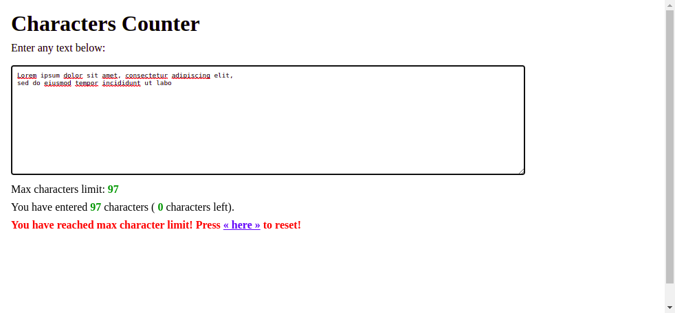

# Characters Counter

Counting characters entered into textarea element.

## Features

- counting characters entered into textarea element
- limits enetered characters to predefined number of characters

## Technologies used

- HTML
- CSS
- JavaScript

## Preview

Live demo: [click here](https://pawelpohland.github.io/characters-counter/)

